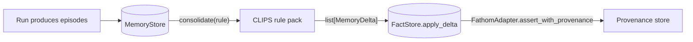

# Memory

Stargraph splits memory into two tiers:

- **Episodic** (`MemoryStore`) — raw events scoped `(user, session, agent)`.
- **Semantic** (`FactStore`) — promoted facts scoped `(user, agent)`. Session
  drops out by design — semantic facts are session-independent.

A consolidation rule fires on a declared cadence, reads recent episodes,
and emits **typed deltas** that the `FactStore` applies through the
existing `FathomAdapter.assert_with_provenance` seam. KG triple → fact
promotion is one-way (Graphiti invalidation model).

## Episodic → semantic consolidation



The cadence is IR-declared:

- `every: 100 episodes` — count-based.
- `cron: '0 3 * * *'` — wall-clock.
- `every: 1` — streaming opt-in.

**Sleep-cycle batch is the default.** Practitioner reports describe naive
streaming summarization losing ~20% of facts; batch is the safer answer.
Cadence machinery reuses CLIPS rule scheduling already in `stargraph.fathom`
— no second scheduler.

## Mem0-style typed deltas

Consolidation never blind-inserts. Rules emit a `MemoryDelta` discriminated
union — the only acceptable promotion path:

```python
from stargraph.stores import MemoryDelta

class AddDelta(BaseModel):
    kind: Literal["add"]
    fact_payload: dict[str, Any]
    source_episode_ids: list[str]
    promotion_ts: datetime
    rule_id: str
    confidence: float

class UpdateDelta(BaseModel):
    kind: Literal["update"]
    replaces: list[str]              # required
    fact_payload: dict[str, Any]
    source_episode_ids: list[str]
    promotion_ts: datetime
    rule_id: str
    confidence: float

class DeleteDelta(BaseModel):
    kind: Literal["delete"]
    replaces: list[str]              # required
    source_episode_ids: list[str]
    promotion_ts: datetime
    rule_id: str
    confidence: float

class NoopDelta(BaseModel):
    kind: Literal["noop"]
    source_episode_ids: list[str]
    promotion_ts: datetime
    rule_id: str
    confidence: float

MemoryDelta = Annotated[
    AddDelta | UpdateDelta | DeleteDelta | NoopDelta,
    Field(discriminator="kind"),
]
```

`source_episode_ids`, `promotion_ts`, `rule_id`, and `confidence` are
**Pydantic-mandatory**, not optional. `replaces` is required on `UPDATE`
and `DELETE`. Validation runs at `apply_delta` entry. `NOOP` records an
audit trail without changing state.

Apply path:

| Delta | `FactStore.apply_delta` action |
|---|---|
| `add` | `FathomAdapter.assert_with_provenance(fact, bundle)` |
| `update` | `unpin(replaces[*])` then `assert_with_provenance(new_fact, bundle)` |
| `delete` | `unpin(replaces[*])` |
| `noop` | audit-only, no state change |

`FactConflictError` fires when `replaces` cannot be resolved deterministically.

## 3-tuple write, widening read

Episodic write key is always the full `(user, session, agent)` tuple.
Reads widen:

| Pattern | Returns |
|---|---|
| `recent(user, session, agent)` | this session only |
| `recent(user, agent=...)` (omit `session`) | cross-session for `(user, agent)` |
| `recent(user)` | all sessions, all agents for that user |

Keys use a **trailing-separator encoding** —
`/user/Alice/session/S1/agent/rag/` — to prevent prefix collisions on
`LIKE` scans. Without the trailing slash, `/user/Alice/...` would also
match `Alice2`. The encoded key lives in `episodes.scope_key`.

## Salience scoring (Park 2023)

The `SalienceScorer` Protocol returns `[0, 1]` per episode:

```python
class SalienceScorer(Protocol):
    async def score(self, memory: Episode, context: SalienceContext) -> float: ...
```

The v1 default is `RuleBasedScorer` — recency × frequency × rule-match —
implementing the Park et al. 2023 formula structurally:

```
score = w_recency × exp(-Δt / τ)
      + w_relevance × cos(q_emb, m_emb)
      + w_importance × imp(m)
```

Two structural points from the paper:

- **Recency uses last-access timestamp**, not creation. Episodes accessed
  recently bubble up regardless of age.
- **Decay is exponential.** `τ` (tau) is configurable per
  `SalienceContext`; default 1 day in seconds.

The v1 scorer fixes `w_relevance = w_importance = 0.0` (rule-based-only
constraint per the epic decision); v2 swaps in the embedding-similarity
term, v3 swaps in a learned scorer (XGBoost on top of the engine ML
registry). The Protocol is stable across all three; only weights and
scorer instance change.

Output is bounded:

```python
return max(0.0, min(1.0, score))
```

A property test enforces both the bounds invariant and recency
monotonicity (older = lower).

See [design §3.4–3.6](https://github.com/KrakenNet/stargraph/blob/main/specs/stargraph-knowledge/design.md)
for the MemoryStore Protocol, FactStore Protocol, and SalienceScorer details.
