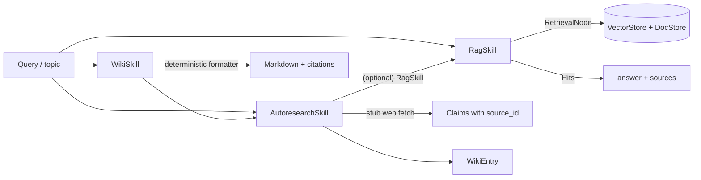

# Reference skills tutorial: `rag → autoresearch → wiki`

Three reference skills ship in-tree at `stargraph.skills.refs.*`. They are real
packages — not doc-only placeholders — and they compose end-to-end:

- **`rag`** — `RetrievalNode (vector + doc) → LLM → answer`. The lowest-level
  retrieval-augmented skill. Wires directly to a `VectorStore` + `DocStore`
  pair via a `store_resolver`.
- **`autoresearch`** — ReAct-style agent that gathers claims with mandatory
  provenance. Uses `rag` internally for the vector branch; falls back to a
  stubbed web fetch when no `store_resolver` is supplied. Every emitted
  `Claim` carries a `source_id` that resolves into the run's `sources` dict.
- **`wiki`** — workflow that drives `autoresearch`, then renders a markdown
  document with numbered citations and a `## Sources` block. Every
  `Claim.source_id` round-trips through composition (AC-7.3 invariant).

This page walks the composition top-down. Code is paste-runnable against the
POC implementations; production wiring (real LLM, real web fetch) is
documented inline as Phase-2 follow-ups.

## Mental model



Every arrow that crosses a skill boundary writes through the skill's declared
`state_schema`. Undeclared writes raise at compile time
([Skills → Declared output channels](skills.md#declared-output-channels)).

## Skill 1: `rag`

`RagSkill` composes `RetrievalNode` (vector + doc fan-out) with a POC LLM stub
and an answer-assembly step. Capabilities declared on the manifest:
`db.vectors:read`, `db.docs:read`, `llm.generate`.

```python
from stargraph.skills.refs.rag import RagSkill, RagState
from stargraph.ir._models import StoreRef
from stargraph.skills.base import SkillKind

skill = RagSkill(
    name="rag",
    version="0.1.0",
    description="POC RAG reference",
    state_schema=RagState,
)

state = RagState(query="What is replay-first design?")

# `stores` is a list of IR-side StoreRefs declaring which providers fan out
# under RetrievalNode; `store_resolver` maps each ref to its concrete instance.
out = await skill.run(
    state,
    ctx,
    stores=[StoreRef(kind="vector", id="docs"), StoreRef(kind="doc", id="docs")],
    store_resolver=lambda ref: my_provider_lookup[ref],
    k=5,
)
print(out.answer)        # "Based on N sources: POC stub answer"
print(out.sources)       # ["hit-id-1", "hit-id-2", ...]
```

The POC `_llm_stub` returns a deterministic string keyed off retrieved hit
count so smoke tests have something to assert on without a model dependency.
Phase 2 routes this through the engine model registry (design §3.9).

**State schema** (`RagState`) declares five output channels:
`query, retrieved, context_window, answer, sources`. The `SubGraphNode`
boundary translator uses these field names as the parent-state write
whitelist.

## Skill 2: `autoresearch`

`AutoresearchSkill` is `kind=agent` — an open-ended ReAct loop in production.
The POC drives gather → assemble: it stubs a web fetch, optionally calls
`RagSkill` for the vector branch, then assembles a `WikiEntry` after verifying
every `Claim.source_id` resolves into the `sources` dict.

```python
from stargraph.skills.refs.autoresearch import AutoresearchSkill, AutoresearchState

skill = AutoresearchSkill(
    name="autoresearch",
    version="0.1.0",
    description="POC autoresearch",
    state_schema=AutoresearchState,
)

state = AutoresearchState(topic="stargraph knowledge subsystem")
out = await skill.run(state)

for claim in out.claims:
    src = out.sources[claim.source_id]   # never KeyError -- AC-7.2 invariant
    print(f"- {claim.text}  ({src.kind}: {src.uri})")

print(out.wiki_entry.summary)
```

The provenance invariant is enforced at assembly time:

```python
for claim in claims:
    if claim.source_id not in sources:
        raise ValueError(
            f"Orphan provenance: claim {claim.id!r} references "
            f"source_id {claim.source_id!r} not in sources dict"
        )
```

This is the AC-7.2 contract. **Orphaned provenance loud-fails**; the skill
never emits a `WikiEntry` whose claims point at sources the operator can't
inspect.

**Optional vector branch.** Pass `stores=` and `store_resolver=` to opt into
the `RagSkill`-driven retrieval branch:

```python
out = await autoresearch.run(
    state,
    stores=[StoreRef(kind="vector", id="docs")],
    store_resolver=lambda ref: my_lookup[ref],
    k=3,
)
```

The POC currently no-ops the vector branch (`del ctx, stores, store_resolver,
k`) so the smoke path stays on the deterministic web stub. Phase 2 lights up
the branch and routes web fetches through `stargraph.tools.web` gated by the
`web.read` capability.

## Skill 3: `wiki`

`WikiSkill` is `kind=workflow` — fixed topology, no LLM-driven control flow.
It drives `AutoresearchSkill` to build a `WikiEntry`, then renders it as
markdown with numbered inline citations.

```python
from stargraph.skills.refs.wiki import WikiSkill, WikiState

skill = WikiSkill(
    name="wiki",
    version="0.1.0",
    description="POC wiki workflow",
    state_schema=WikiState,
)

state = WikiState(topic="Cypher portable subset")
out = await skill.run(state)
print(out.markdown)
```

Sample output:

```markdown
# Cypher portable subset

POC stub summary for Cypher portable subset (2 claims)

## Claims

- Cypher portable subset is a documented subject. [1]
- Cypher portable subset has multiple cited references. [2]

## Sources

1. `web:Cypher portable subset:0` (web) — web:Cypher portable subset:0
2. `web:Cypher portable subset:1` (web) — web:Cypher portable subset:1
```

The formatter is deterministic — no LLM call yet. Citation numbering is
**stable across runs**: claims index into `citation_index` in first-reference
order. Phase 2 swaps `_format_markdown` for an `llm.generate` call.

## Composition contract: provenance round-trip

The end-to-end invariant binding all three skills is **provenance preservation
across composition**. Concretely:

1. `RagSkill` emits `sources: list[str]` of retrieved hit ids.
2. `AutoresearchSkill` emits `Claim`s with mandatory `source_id` and a
   `sources: dict[str, SourceRecord]` that resolves every id.
3. `WikiSkill._format_markdown` walks `ar_state.claims` and **loud-fails** if
   any `claim.source_id` is missing from `ar_state.sources`:

    ```python
    if claim.source_id not in ar_state.sources:
        msg = (
            f"Provenance break: claim {claim.id!r} references "
            f"source_id {claim.source_id!r} not in sources dict"
        )
        raise ValueError(msg)
    ```

4. The rendered markdown threads each `source_id` into a `[N]` citation marker
   that indexes into the `## Sources` block — every claim is auditable from
   the rendered document alone.

This is AC-7.3: **provenance must round-trip through composition**. The test
suite for the wiki skill drives a topic end-to-end and asserts that each
emitted `[N]` resolves to a `SourceRecord` whose `id` matches the cited
`Claim.source_id`. Composition that drops provenance fails CI loudly.

## Capability declarations

Each skill declares the minimum capability set its run exercises. The FR-7
capability gate enforces these at run-admission time:

| Skill | Capabilities |
|---|---|
| `rag` | `db.vectors:read`, `db.docs:read`, `llm.generate` |
| `autoresearch` | `web.read`, `db.vectors:read`, `db.docs:read`, `llm.generate` |
| `wiki` | `db.docs:write`, `llm.generate` |

`wiki` declares `db.docs:write` because the rendered markdown is intended to
land in a `DocStore`; that write is delegated to the caller in the POC, but
the manifest already carries the capability so the gate is honest about the
skill's eventual surface.

## Replay & subgraph site ids

All three skills are real subgraphs under the hood. When a parent graph
composes them via `SubGraphNode.from_skill(...)`, the engine pins each
skill's instantiation **site id** from its IR position — not from
LangGraph's call-order assignment (AC-3.5). Topology mutations in unrelated
regions of the parent graph do not invalidate skill replay; only edits that
touch the skill's own region force a `graph_hash` mismatch.

This means: you can wire `wiki` into one corner of a larger
agent-as-subgraph and freely refactor the other corners; replay survives.

See [Skills → Agent-as-subgraph](skills.md#agent-as-subgraph) for the full
composition seam, and [design §3.10–3.12](https://github.com/KrakenNet/stargraph/blob/main/specs/stargraph-knowledge/design.md)
for the per-skill specs.
