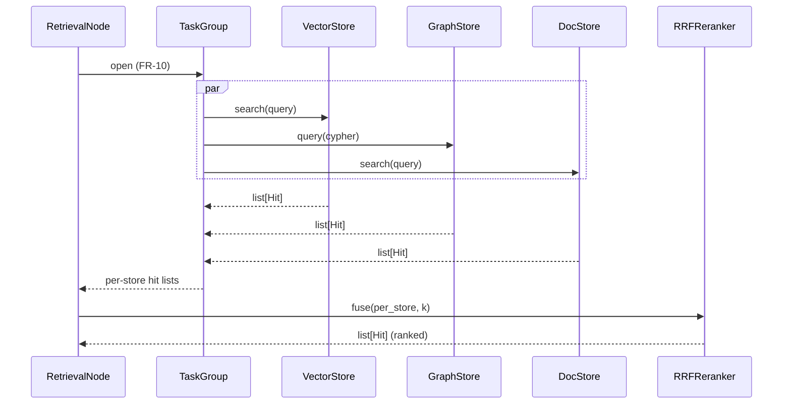

# Retrieval

`RetrievalNode` is the engine-aware node that fans a query out across one
or more stores in parallel and fuses the per-store hit lists into a single
ranked result. It subscribes to engine FR-10 TaskGroup primitives and
emits `stargraph.transition` facts per branch (engine FR-13).

## Parallel fan-out



Skeleton:

```python
class RetrievalNode(NodeBase):
    """Parallel fan-out across [VectorStore | GraphStore | DocStore]."""

    async def execute(self, state, ctx):
        query = state.query
        async with create_task_group() as tg:
            tasks = [
                tg.start_soon(self._dispatch, self.store_resolver(s.name), query)
                for s in self.stores
            ]
        per_store = [t.result() for t in tasks]
        reranker = self.rerank or RRFReranker()
        fused = await reranker.fuse(per_store, k=self.k)
        return {"retrieved": fused}
```

Two fan-out invariants:

- **No cross-store re-embedding.** Each store embeds the query with its
  own configured embedder; results merge at rank-fusion only (FR-14
  contract). A unit test (`test_retrieval_node_no_cross_store_reembed`)
  guards the rule.
- **Capability-bound.** The node's `requires` resolves to `db.<store>:read`
  for every `StoreRef` plus reranker-specific capabilities (FR-20). A
  Cypher-write keyword scan applies whenever `GraphStore.query` is
  invoked.

## RRF fusion (deterministic sum order)

The default reranker is **Reciprocal Rank Fusion** — no model, no API key,
no extra dependency. The Reranker Protocol is one method:

```python
class Reranker(Protocol):
    async def fuse(self, per_store: list[list[Hit]], *, k: int) -> list[Hit]: ...
```

`RRFReranker` computes:

```
RRF(d) = Σ over store s where d ∈ s : 1 / (k + rank_s(d))
```

…with `k = 60` by default. **Determinism comes from the sum order** — the
implementation iterates `per_store` in the order returned by the
TaskGroup (which itself returns tasks in spawn order, not completion
order), then sums `Hit` contributions keyed by `(doc_id, source_store)`.
Two consequences worth stating:

1. The same `(query, stores, configs)` produces a byte-identical
   `list[Hit]` across runs — the property `test_rrf_fusion_idempotent`
   exists for exactly this reason.
2. Floating-point sum order is stable; we never rely on
   commutative-but-non-associative IEEE-754 reordering.

Ties break by `(score, doc_id)` ascending — `doc_id` is a stable
content-addressed string from the source store, so the tie-break is
itself deterministic.

## Reranker pluggability

`stargraph.rerankers` is a pluggy entry-point group. Three opt-in rerankers
ship as optional installs:

| Reranker | Install extra | Notes |
|---|---|---|
| `CrossEncoderReranker` | `stargraph[skills-rag]` | Local sentence-transformers cross-encoder |
| `CohereReranker` | `stargraph[skills-rag]` | Network call; capability-gated |
| `JinaReranker` | `stargraph[skills-rag]` | Network call; capability-gated |

The default `RRFReranker()` ships with the core `stargraph.stores` install —
zero extra dependencies, zero API keys. Pluggable rerankers live behind
the same `Reranker` Protocol so swaps are mechanical.

## State contract

`RetrievalNode` reads `state.query` and writes a single declared channel:

```python
class RetrievalState(BaseModel):
    query: str
    retrieved: list[Hit] = []
```

Composition pattern:

```
RetrievalNode (vector + doc) → LLM-call node → answer-validation node
```

`Hit` carries enough provenance to round-trip:
`(doc_id, score, source_store, metadata)`. Downstream nodes attach these
into `ProvenanceCitation` records that the `FactStore` consumes if the
output is promoted.

See [design §3.8](https://github.com/KrakenNet/stargraph/blob/main/specs/stargraph-knowledge/design.md)
for the full RetrievalNode spec and the Reranker Protocol.
