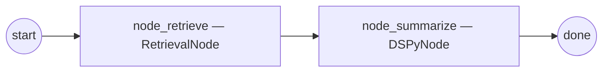

# Tutorial: Agent with Retrieval

In this tutorial you'll build a two-node retrieval-augmented graph: a
`RetrievalNode` queries a LanceDB-backed vector store, and a
`DSPyNode` summarises the fused hits. The DSPy seam runs through
`stargraph.adapters.dspy.bind`, so the force-loud filter raises
`AdapterFallbackError` if DSPy ever silently swaps to JSON mode mid-run.

## What you'll build



State carries `query: str` (input), `retrieved: list[Hit]` (fused
results), and `summary: str` (DSPy output). The vector store is seeded
with three short documents so the lesson runs in seconds with no
network round-trip.

## Prerequisites

- The [first graph](first-graph.md) tutorial completed (you have a
  working Stargraph install + state model pattern).
- `pip install 'stargraph[stores,ml]'` — pulls LanceDB, sentence-
  transformers, DSPy.
- A local OpenAI-compatible LM endpoint (Ollama, vLLM, llama-cpp). The
  examples below assume Ollama at `http://localhost:11434/v1` with
  `gpt-oss:20b`.

## Step 1 — Define the state model

```python
# state.py
from __future__ import annotations

from pydantic import BaseModel, Field

from stargraph.stores.vector import Hit


class RagState(BaseModel):
    query: str = ""
    retrieved: list[Hit] = Field(default_factory=list)
    summary: str = ""
```

`Hit` is the canonical row shape from `stargraph.stores.vector`:
`(id, score, metadata)`. `RetrievalNode` writes into `state.retrieved`
under the `"retrieved"` key per the field-merge registry contract
(FR-11).

## Step 2 — Seed the LanceDB store

Save this as `seed.py` and run it once. It loads the
`MiniLMEmbedder` (sha256-pinned safetensors) and inserts three rows
into a fresh LanceDB table at `./.lance`.

```python
# seed.py
import asyncio
from pathlib import Path

from stargraph.stores.embeddings import MiniLMEmbedder
from stargraph.stores.lancedb import LanceDBVectorStore
from stargraph.stores.vector import Row


async def main() -> None:
    store = LanceDBVectorStore(
        path=Path("./.lance"),
        embedder=MiniLMEmbedder(),
    )
    await store.bootstrap()
    await store.upsert(
        rows=[
            Row(id="d1", text="Stargraph compiles a stateful agent graph from IR YAML."),
            Row(id="d2", text="Fathom enforces deterministic governance via CLIPS rules."),
            Row(id="d3", text="LanceDB powers the vector store with FTS + ANN hybrid search."),
        ],
    )
    print("seeded:", await store.health())


if __name__ == "__main__":
    asyncio.run(main())
```

```bash
uv run python seed.py
```

Verify: a `./.lance/` directory now exists with `vectors.lance` plus a
`_stargraph_meta` sidecar.

## Step 3 — Wire the DSPy module

Save this as `dspy_module.py`. The signature has one input
(`question`) and one output (`summary`). The wrapper installs the
force-loud filter and constructs a `DSPyNode` with the
`JSONAdapter` + `ChatAdapter(use_json_adapter_fallback=False)` pair
per design §3.3.1.

```python
# dspy_module.py
from __future__ import annotations

import dspy

from stargraph.adapters.dspy import _install_filter
from stargraph.nodes.base import NodeBase
from stargraph.nodes.dspy import DSPyNode


class Summarise(dspy.Signature):
    """Summarise retrieved snippets in one sentence."""

    question: str = dspy.InputField()
    summary: str = dspy.OutputField()


class SummariseNode(NodeBase):
    """Zero-arg subclass so the IR's `kind:` resolver can build it."""

    def __init__(self) -> None:
        _install_filter()
        self._inner = DSPyNode(
            module=dspy.Predict(Summarise),
            adapter=dspy.JSONAdapter(use_native_function_calling=True),
            chat_adapter=dspy.ChatAdapter(use_json_adapter_fallback=False),
            signature_map={"query": "question"},
        )

    async def execute(self, state, ctx):
        return await self._inner.execute(state, ctx)
```

To fold retrieved hits into the prompt, expand the signature with a
`context` input and add a small adapter node — left out so the
lesson stays focused on the DSPy seam.

## Step 4 — Author the graph

```yaml
# graph.yaml
ir_version: "1.0.0"
id: "run:rag-hello"
state_class: "state:RagState"
nodes:
  - id: node_retrieve
    kind: "retrieval_node:RetrievalNodeFactory"
  - id: node_summarize
    kind: "dspy_module:SummariseNode"
stores:
  - name: docs
    provider: lancedb
rules:
  - id: r-retrieve-to-summarize
    when: "?n <- (node-id (id node_retrieve))"
    then:
      - kind: goto
        target: node_summarize
  - id: r-halt
    when: "?n <- (node-id (id node_summarize))"
    then:
      - kind: halt
        reason: "summary produced"
```

Both `kind:` strings use the `module:ClassName` form
`stargraph.cli.run._resolve_node_factory` understands; each must resolve
to a `NodeBase` subclass with a zero-arg constructor.

## Step 5 — Wire the retrieval node

Save this as `retrieval_node.py`. The wrapper builds a `RetrievalNode`
with one `StoreRef` (matching the `stores:` block in the IR) and a
resolver that maps the store name to the `LanceDBVectorStore`.

```python
# retrieval_node.py
from __future__ import annotations

from pathlib import Path

from stargraph.ir._models import StoreRef
from stargraph.nodes.base import NodeBase
from stargraph.nodes.retrieval import RetrievalNode
from stargraph.stores.embeddings import MiniLMEmbedder
from stargraph.stores.lancedb import LanceDBVectorStore


_STORE = LanceDBVectorStore(path=Path("./.lance"), embedder=MiniLMEmbedder())


def _resolver(name: str):
    if name == "docs":
        return _STORE
    raise KeyError(name)


class RetrievalNodeFactory(NodeBase):
    def __init__(self) -> None:
        self._inner = RetrievalNode(
            stores=[StoreRef(name="docs", provider="lancedb")],
            store_resolver=_resolver,
            k=3,
        )

    async def execute(self, state, ctx):
        return await self._inner.execute(state, ctx)
```

`store_resolver` is `Callable[[str], VectorStore | GraphStore |
DocStore]`. Production graphs wire the engine's StoreRegistry; the
module-level singleton above is fine for a tutorial.

## Step 6 — Run end-to-end

```bash
uv run stargraph run graph.yaml \
  --inputs query="What does Stargraph compile?" \
  --lm-url http://localhost:11434/v1 \
  --lm-model gpt-oss:20b \
  --log-file ./.stargraph/audit.jsonl
```

The CLI configures `dspy.LM(...)` against the OpenAI-compatible
endpoint (see `_configure_lm` in `src/stargraph/cli/run.py`). Expected
last line:

```
run_id=run-… status=done
```

Inspect the run:

```bash
uv run stargraph inspect "$RUN_ID" --db ./.stargraph/run.sqlite --step 1
```

The state-at-step JSON shows `retrieved` populated with the top-3
fused hits and `summary` with the DSPy output.

## Troubleshooting

- **`AdapterFallbackError: Failed to use structured output format…`** —
  the force-loud filter intercepted DSPy's silent `ChatAdapter →
  JSONAdapter` swap. Fix the signature; do not work around the filter.
- **`EmbeddingModelHashMismatch`** — a network fetch returned a MiniLM
  build whose safetensors hash doesn't match `MINILM_SHA256`. Pre-stage
  the model directory and pass `MiniLMEmbedder(model_path=...)`.
- **`store search returned []`** — verify `seed.py` ran and the
  `./.lance/_stargraph_meta` sidecar exists; the embedder identity tuple
  must match across boot and seed.

## What to read next

- [Reference → nodes / retrieval](../reference/nodes/retrieval.md) —
  full RRF fusion semantics and per-store dispatch table.
- [Reference → nodes / dspy](../reference/nodes/dspy.md) — the
  `SignatureMap` shape and force-loud guarantees.
- [Reference → stores / vector](../reference/stores/vector.md) —
  `Row`, `Hit`, and the `mode={vector,fts,hybrid}` switch.
- [Tutorial: Classical ML in a graph](ml-node-graph.md) — drop-in
  `MLNode` for ONNX classifiers running alongside the DSPy node.
