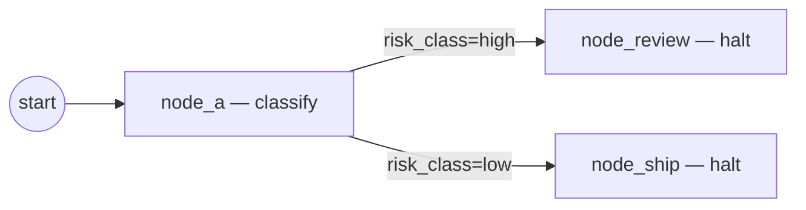

# Tutorial: Add a Fathom Rule Pack

In this tutorial you'll wrap the [first-graph](first-graph.md) with a
single Fathom rule that gates routing on a state field, see the rule
fire in the audit log, and validate the pack with the kraken-plugins
Fathom tooling.

## What you'll build



A two-branch routing rule lifted out of the graph YAML and into a
versioned rule pack mounted under `governance:`. Same engine, same
event stream — the rule simply lives in a pack now and is signed,
validated, and replayable independently of the IR.

## Prerequisites

- The [first graph](first-graph.md) project from the previous tutorial.
- `uv add kraken-plugins-fathom` (provides the `/fathom:*` authoring
  commands referenced below).
- `uv add stargraph[fathom]` if your install excluded the Fathom
  integration.

## Step 1 — Add a routing field to state

Edit `state.py` so the run carries a `risk_class` we can branch on:

```python
# state.py
from __future__ import annotations

from typing import Literal

from pydantic import BaseModel


class HelloState(BaseModel):
    message: str = ""
    risk_class: Literal["low", "high"] = "low"
```

## Step 2 — Scaffold the rule pack

Use the Fathom plugin's scaffolder to create the pack skeleton. Each
file lands under `packs/hello.routing/`.

```bash
uv run fathom new-rule-pack \
  --id hello.routing \
  --version 1.0.0 \
  --out packs/hello.routing
```

The scaffolder produces `pack.yaml`, `templates/`, `rules/`,
`modules/`, `functions/`, `tests/`, and a `README.md`. We only need
`pack.yaml` and one rule file for this tutorial.

## Step 3 — Author the rule

Save this as `packs/hello.routing/rules/route_by_risk.yaml`. The
`when` pattern matches the `node-id` fact emitted at every node-exit
boundary plus the projected `state` fact; the `then` action is a
Stargraph `goto`.

```yaml
# packs/hello.routing/rules/route_by_risk.yaml
defrule:
  id: r-route-high-risk
  when: |
    ?n <- (node-id (id node_a))
    (state (risk_class high))
  then:
    - kind: goto
      target: node_review

defrule:
  id: r-route-low-risk
  when: |
    ?n <- (node-id (id node_a))
    (state (risk_class low))
  then:
    - kind: goto
      target: node_ship
```

!!! note "Action vocabulary"
    The pack's `then:` actions are the same six Stargraph verbs the IR's
    inline `rules:` block accepts (`goto`, `parallel`, `halt`, `retry`,
    `assert`, `retract`). Pack rules and inline rules merge into a
    single rule set at compile time.

## Step 4 — Validate the pack

Run the Fathom validator before mounting the pack — broken patterns
are far cheaper to catch here than mid-run.

```bash
uv run fathom validate packs/hello.routing
```

You should see `OK` and a count of rules / templates. If a pattern
fails, the validator prints the line and the underlying CLIPS error.

## Step 5 — Wire the pack into the graph

Update `graph.yaml`: add the two terminal nodes and a `governance:`
mount that points at the pack id. Drop the old inline routing rules —
the pack provides them now.

```yaml
# graph.yaml
ir_version: "1.0.0"
id: "run:hello-stargraph"
state_class: "state:HelloState"
nodes:
  - id: node_a
    kind: echo
  - id: node_review
    kind: halt
  - id: node_ship
    kind: halt
governance:
  - id: hello.routing
    version: "1.0.0"
    requires:
      stargraph_facts_version: "1.0"
      api_version: "1"
rules:
  - id: r-halt-review
    when: "?n <- (node-id (id node_review))"
    then:
      - kind: halt
        reason: "high-risk path — halt for review"
  - id: r-halt-ship
    when: "?n <- (node-id (id node_ship))"
    then:
      - kind: halt
        reason: "low-risk path — shipped"
```

The `requires:` block pins the pack to a `stargraph_facts_version` /
`api_version` pair; mismatches fail loud at pack-load time per
`stargraph.ir._versioning.check_pack_compat`.

## Step 6 — Run the high-risk branch

```bash
uv run stargraph run graph.yaml \
  --inputs message=hello \
  --inputs risk_class=high \
  --log-file ./.stargraph/audit.jsonl
```

Expected progress lines:

```
✔ node_a → node_review
✔ done
…
run_id=run-… status=done
```

## Step 7 — Verify the rule fired

Filter the audit log for the rule firing event:

```bash
RUN_ID=$(uv run stargraph inspect "$RUN_ID" --db ./.stargraph/run.sqlite | head -1 | awk '{print $1}')
grep '"rule_id":"r-route-high-risk"' ./.stargraph/audit.jsonl
```

You should see one record per matched step with the pack id, rule id,
matched node id, and action kind. Re-run with `--inputs
risk_class=low` to confirm `r-route-low-risk` fires instead and the
run terminates at `node_ship`.

## Step 8 — Test the rule pack

The Fathom plugin can run rule-pack tests against a fixture fact set:

```bash
uv run fathom test packs/hello.routing
```

This is the same `pytest`-driven harness the kraken-plugins Fathom
docs describe; failures surface as branch-coverage hints so you can
spot dead `when:` clauses.

## What to read next

- [Concepts → Plugins](../concepts/plugins.md) — how packs are
  discovered, signed, and version-pinned.
- [Explanation → Fathom gaps](../explanation/fathom-gaps.md) — what
  Fathom does not do (no backward chaining, template hot-reload is
  restart-bound).
- [How-to → Author a Bosun pack](../how-to/bosun-pack.md) — pack
  layout for the wider Bosun-flavoured packs (skills + prompts +
  policies, not just rules).
- The kraken-plugins Fathom plugin ships `/fathom:new-rule`,
  `/fathom:new-template`, `/fathom:bench`, and `/fathom:reload-rules`
  for the rest of the rule-pack authoring loop.
