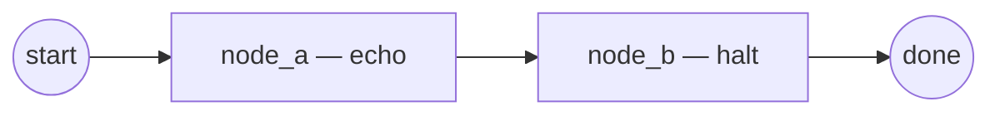

# Tutorial: Your First Graph

In this tutorial you'll assemble the smallest useful Stargraph graph: two
nodes, one routing rule, one Pydantic state field. You will execute it
with `stargraph run`, inspect the resulting checkpoint database with
`stargraph inspect`, and learn how the IR YAML maps onto the runtime.

## What you'll build



Two nodes, both built on `EchoNode` from `stargraph.nodes.base`. The first
copies the seeded `message` field through state; the second is a marker
terminal that triggers `kind: halt` from the rule pack and ends the run
cleanly. There is no LLM, no store, no tool call — the goal is to see
the engine load IR YAML, build a `Graph`, drive a `GraphRun`, persist
checkpoints, and emit events.

## Prerequisites

- Python 3.13+
- `uv add stargraph` (or `pip install stargraph`)
- A working directory you don't mind littering with `./.stargraph/`

## Step 1 — Create the project

```bash
mkdir hello-stargraph && cd hello-stargraph
uv init --bare
uv add stargraph
```

Verify the CLI is on `$PATH`:

```bash
uv run stargraph --help
```

You should see the seven subcommands: `run`, `inspect`, `simulate`,
`counterfactual`, `replay`, `respond`, `serve`.

## Step 2 — Declare the state model

Save this as `state.py`. Stargraph's IR loader can either compile a flat
`state_schema:` map (primitives only) or load an existing Pydantic
`BaseModel` via `state_class: module.path:ClassName`. The latter scales
to richer state, so we'll use it from the start.

```python
# state.py
from __future__ import annotations

from pydantic import BaseModel


class HelloState(BaseModel):
    """Minimal run state: one mutable string field."""

    message: str = ""
```

## Step 3 — Author the graph

Save this as `graph.yaml`. Two nodes (`echo` and `halt`, both backed by
`EchoNode` per `stargraph.cli.run._NODE_FACTORIES`), one routing rule that
fires on the start step, one halting rule.

```yaml
# graph.yaml
ir_version: "1.0.0"
id: "run:hello-stargraph"
state_class: "state:HelloState"
nodes:
  - id: node_a
    kind: echo
  - id: node_b
    kind: halt
rules:
  - id: r-advance
    when: "(initial-fact)"
    then:
      - kind: goto
        target: node_b
  - id: r-halt
    when: "?n <- (node-id (id node_b))"
    then:
      - kind: halt
        reason: "First-graph tutorial reached node_b"
```

!!! note "Where these kinds come from"
    `kind: echo` and `kind: halt` map to `EchoNode` via the static
    factory table in `src/stargraph/cli/run.py`. For your own nodes,
    use the `module.path:ClassName` form (e.g.
    `stargraph.nodes.dspy:DSPyNode`) — the resolver imports it
    dynamically.

## Step 4 — Smoke-check with `--inspect`

Before running anything, verify the rule trace under synthetic
zero-value fixtures. `--inspect` skips node execution and only walks
the rule firings.

```bash
uv run stargraph run graph.yaml --inspect
```

Expected output (the graph hash will vary):

```
graph_hash=sha256:…
rule_firings=2
  rule=r-advance fired=True matched=[node_a] actions=[goto]
  rule=r-halt fired=True matched=[node_b] actions=[halt]
```

If `rule_firings=0`, the rule patterns don't match the IR — fix them
before going further.

## Step 5 — Execute end-to-end

```bash
uv run stargraph run graph.yaml --inputs message=hello --log-file ./.stargraph/audit.jsonl
```

Expected stdout (run id will vary):

```
✔ node_a → node_b
✔ done
…
run_id=run-… status=done
```

The CLI writes:

- `./.stargraph/run.sqlite` — checkpoint database (default path; override
  with `--checkpoint`).
- `./.stargraph/runs/<run_id>/` — per-run artifact directory.
- `./.stargraph/audit.jsonl` — per-event JSONL audit log (because we
  passed `--log-file`).

## Step 6 — Inspect the run

Pull the run id from the last stdout line and feed it to `stargraph inspect`.

```bash
RUN_ID=$(uv run stargraph run graph.yaml --inputs message=hello \
  --log-file ./.stargraph/audit.jsonl --no-summary | tail -1 | cut -d= -f2 | cut -d' ' -f1)
uv run stargraph inspect "$RUN_ID" --db ./.stargraph/run.sqlite
```

You'll see one row per checkpointed step with `(step, transition_type,
node_id, tool_calls, rule_firings)`. To dump the canonical state at a
specific step:

```bash
uv run stargraph inspect "$RUN_ID" --db ./.stargraph/run.sqlite --step 1
```

This prints the IR-canonical state dict as JSON. To diff CLIPS facts
between two steps:

```bash
uv run stargraph inspect "$RUN_ID" --db ./.stargraph/run.sqlite --diff 0 1
```

## Step 7 — Add a smoke test

Save this as `tests/test_smoke.py` and run with `uv run pytest`.

```python
# tests/test_smoke.py
from pathlib import Path

import yaml

GRAPH = Path(__file__).resolve().parent.parent / "graph.yaml"


def test_graph_loads():
    doc = yaml.safe_load(GRAPH.read_text())
    assert doc["ir_version"] == "1.0.0"
    assert {n["id"] for n in doc["nodes"]} == {"node_a", "node_b"}


def test_routing_targets_exist():
    doc = yaml.safe_load(GRAPH.read_text())
    nodes = {n["id"] for n in doc["nodes"]}
    for rule in doc["rules"]:
        for action in rule["then"]:
            target = action.get("target")
            if target is not None:
                assert target in nodes, f"unknown target {target!r} in {rule['id']}"
```

## What to read next

- [Concepts → IR](../concepts/ir.md) — the full shape of `IRDocument`,
  `NodeSpec`, `RuleSpec`, and the six `Action` verbs.
- [Reference → nodes / base](../reference/nodes/base.md) — the
  `NodeBase` ABC every custom node implements.
- [Engine → checkpointer](../engine/checkpointer.md) — how the SQLite
  database in `./.stargraph/run.sqlite` is laid out.
- [Tutorial: Add a Fathom rule pack](fathom-rules.md) — layer
  deterministic governance onto this graph.
