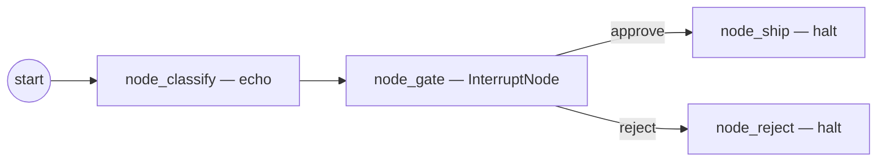

# Tutorial: Human-in-the-Loop Graph

In this tutorial you'll build a graph that pauses on a risk-flag,
emits a `WaitingForInputEvent`, persists a checkpoint, and exits
cleanly. You'll then resume it two ways: inline from the CLI prompt
and out-of-process via `stargraph respond` against a running
`stargraph serve`.

## What you'll build



`InterruptNode` is the bypass-Fathom HITL primitive (see
`src/stargraph/nodes/interrupt/interrupt_node.py`). On dispatch it raises
`_HitInterrupt` carrying an `InterruptAction`; the engine's loop arm
flips state to `awaiting-input`, emits `WaitingForInputEvent`, and
exits without driving further nodes.

## Prerequisites

- Stargraph installed (`uv add stargraph`).
- A working CLI from the [first graph](first-graph.md) tutorial.

## Step 1 — Define state with the decision field

```python
# state.py
from __future__ import annotations

from typing import Literal

from pydantic import BaseModel


class TriageState(BaseModel):
    cve_id: str = ""
    risk_class: Literal["low", "high"] = "low"
    decision: Literal["", "approve", "reject"] = ""
```

The `decision` field is what the HITL response will populate.
`InterruptNode` does NOT write into state on dispatch — the response
fact is asserted by `GraphRun.respond` after resume (per design §9.4
step 4).

## Step 2 — Wire the InterruptNode

Save this as `gate.py`. The node config mirrors `InterruptAction`
verbatim; `interrupt_payload` is the opaque blob exposed to the
analyst over the WebSocket / `GET /v1/runs/{id}` surface.

```python
# gate.py
from __future__ import annotations

from stargraph.nodes.interrupt.interrupt_node import (
    InterruptNode,
    InterruptNodeConfig,
)


class TriageGate(InterruptNode):
    """Zero-arg subclass so the IR's `kind:` resolver can instantiate
    it directly via `stargraph.cli.run._resolve_node_factory`.
    """

    def __init__(self) -> None:
        super().__init__(
            config=InterruptNodeConfig(
                prompt="Approve high-risk CVE remediation? (approve/reject)",
                interrupt_payload={
                    "open_questions": [
                        {
                            "kind": "required",
                            "slot": "decision",
                            "prompt": "approve or reject",
                            "schema": {
                                "type": "string",
                                "enum": ["approve", "reject"],
                            },
                        },
                    ],
                },
                requested_capability="runs:respond",
                timeout=None,            # durable wait
                on_timeout="halt",
            ),
        )
```

!!! warning "`timeout=None` means wait forever"
    Use `timeout=None` when analyst SLAs govern the wait, not the
    engine. For experiments add a
    `timedelta(minutes=5)` and set `on_timeout="goto:node_reject"` so
    untouched runs auto-reject.

## Step 3 — Author the graph

```yaml
# graph.yaml
ir_version: "1.0.0"
id: "run:hitl-hello"
state_class: "state:TriageState"
nodes:
  - id: node_classify
    kind: echo
  - id: node_gate
    kind: "gate:TriageGate"
  - id: node_ship
    kind: halt
  - id: node_reject
    kind: halt
rules:
  - id: r-classify-to-gate-high
    when: "?n <- (node-id (id node_classify)) (state (risk_class high))"
    then:
      - kind: goto
        target: node_gate
  - id: r-classify-to-ship-low
    when: "?n <- (node-id (id node_classify)) (state (risk_class low))"
    then:
      - kind: goto
        target: node_ship
  - id: r-gate-approve
    when: "?n <- (node-id (id node_gate)) (state (decision approve))"
    then:
      - kind: goto
        target: node_ship
  - id: r-gate-reject
    when: "?n <- (node-id (id node_gate)) (state (decision reject))"
    then:
      - kind: goto
        target: node_reject
  - id: r-ship-halt
    when: "?n <- (node-id (id node_ship))"
    then:
      - kind: halt
        reason: "approved + shipped"
  - id: r-reject-halt
    when: "?n <- (node-id (id node_reject))"
    then:
      - kind: halt
        reason: "rejected"
```

## Step 4 — Run interactively (inline resume)

The CLI's `HITLHandler` (see `src/stargraph/cli/_prompts.py`) reads
`interrupt_payload.open_questions`, prompts the operator on stdin, and
calls `run.respond(...)` from the same process.

```bash
uv run stargraph run graph.yaml \
  --inputs cve_id=CVE-2024-9999 \
  --inputs risk_class=high \
  --log-file ./.stargraph/audit.jsonl
```

The CLI will pause:

```
⏸ Approve high-risk CVE remediation? (approve/reject)
Required (1):
  decision: approve or reject
  >
```

Type `approve` and the run resumes inline, terminating at `node_ship`.

## Step 5 — Run with cold-restart resume

To exercise the durable-wait path, run with `--non-interactive`. The
CLI exits non-zero on the `WaitingForInputEvent`; the checkpoint
remains in `./.stargraph/run.sqlite` so the run can resume from a fresh
process later.

```bash
uv run stargraph run graph.yaml \
  --inputs cve_id=CVE-2024-9999 \
  --inputs risk_class=high \
  --non-interactive
```

Expected stderr:

```
✗ run paused for HITL but --non-interactive set
```

Confirm the run is `awaiting-input`:

```bash
RUN_ID=...   # capture from the output
uv run stargraph inspect "$RUN_ID" --db ./.stargraph/run.sqlite --step 1
```

The state JSON will include `"decision": ""` and the timeline will
end at `node_gate` with no further transitions.

## Step 6 — Resume out-of-process via `stargraph respond`

In a second terminal, boot the API:

```bash
uv run stargraph serve --db ./.stargraph/run.sqlite
```

Save the analyst response as JSON and POST it via `stargraph respond`.
The CLI sends `Authorization: Bypass <actor>` so the POC
`BypassAuthProvider` attributes the response fact (see
`src/stargraph/cli/respond.py`).

```bash
echo '{"slot_answers": {"decision": "approve"}}' > approve.json

uv run stargraph respond "$RUN_ID" \
  --response @approve.json \
  --actor analyst-jane
```

Expected: a JSON `RunSummary` printed to stdout with `"status":
"running"` (the engine flipped state back from `awaiting-input` and
the dispatcher picks it up). The respond endpoint returns 401 on
`auth failed`, 404 on missing run, 409 on a run that isn't waiting —
verbatim per the CLI's error envelope.

## Step 7 — Verify the resume

```bash
uv run stargraph inspect "$RUN_ID" --db ./.stargraph/run.sqlite
```

The timeline now extends past `node_gate` to `node_ship` with
`r-gate-approve` recorded between them. The audit log carries both
the `WaitingForInputEvent` and the post-resume
`respond_orchestrated` BosunAuditEvent.

## What to read next

- [Reference → nodes / interrupt](../reference/nodes/interrupt.md) —
  the full `InterruptNodeConfig` schema and timeout policy options.
- [Serve → HITL](../serve/hitl.md) — HTTP resume contract and audit
  mapping.
